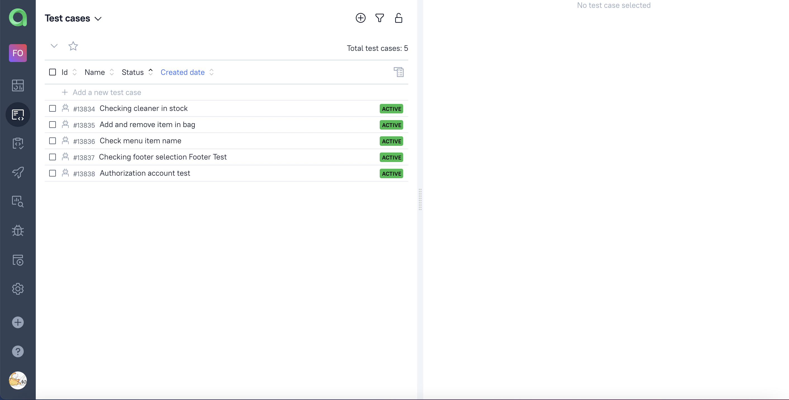

## Проект по автоматизации тестирования сайта https://mi-montenegro.me/

##	Содержание

- [Технологии и инструменты](#technologist-технологии-и-инструменты)
- [Реализованые проверки](#bookmark_tabs-реализованные-проверки)
- [Запуск тестов из терминала](#computer-запуск-тестов-из-терминала)
- [Запуск тестов в Jenkins](#-запуск-тестов-в-jenkins)
- [Отчет о результатах тестирования в Allure Report](#-отчет-о-результатах-тестирования-в-Allure-report)
- [Интеграция с Allure TestOps](#-интеграция-с-allure-testops)
- [Интеграция с Jira](#-интеграция-с-jira)
- [Уведомления в Telegram с использованием бота](#-уведомления-в-telegram-с-использованием-бота)
- [Пример запуска теста в Selenoid](#-пример-запуска-теста-в-selenoid)


## :technologist: Технологии и инструменты

<p  align="center">

<code></code>
<code></code>
<code></code>
<code></code>
<code></code>
<code></code>
<code></code>
<code></code>
<code></code>
<code></code>
<code></code>
<code></code>
</p>


## :bookmark_tabs: Реализованные проверки:
### UI Tests

- Проверка отображаения блоков меню
- Проверка наличия товара
- Проверка добавления и удлаения товара из корзины
- Проверка отображения меню футер
- Авторизация на сайте

## :computer: Запуск тестов из терминала

### Локальный запуск тестов

```bash
gradle clean test
```

### Удаленный запуск тестов

```bash
gradle clean test
-Dbrowser=${BROWSER}
-DbrowserVersion=${BROWSER_VERSION}
-DbrowserSize=${BROWSER_SIZE}
-Dremote=${SERVER_REMOTE}
```


##  Запуск тестов в [Jenkins](https://jenkins.autotests.cloud/job/hw_15_15_AutoTest)

Для запуска сборки необходимо указать значения параметров и нажать кнопку <code><strong>*Собрать*</strong></code>.

<p align="center">
  
</p>

После выполнения сборки, в блоке <code><strong>*История сборок*</strong></code> напротив номера сборки появится
значок *Allure Report*, кликнув по которому, откроется страница с сформированным html-отчетом.

<p align="center">
  
</p>


##  Отчет о результатах тестирования в [Allure Report](https://jenkins.autotests.cloud/job/hw_15_15_AutoTest/16/allure/)

<p align="center">
  
</p>


##  Интеграция с [Allure TestOps](https://allure.autotests.cloud/launch/17925)

## Основной дашборд

<p align="center">
  
</p>

## Тест-кейсы

<p align="center">
  
</p>

##  Интеграция с [Jira](https://jira.autotests.cloud/browse/HOMEWORK-482)

<p align="center">
  
</p>

##  Уведомления в Telegram с использованием бота
После завершения сборки специальный бот, созданный в <code>Telegram</code>, автоматически обрабатывает и отправляет сообщение с отчетом о прогоне тестов.

<p align="center">

</p>

##  Пример запуска теста в Selenoid

К каждому тесту в отчете прилагается видео.

<p align="center">
  
</p>
	Содержание

